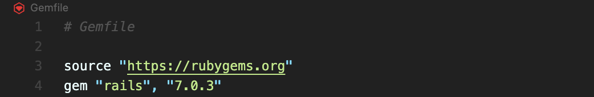

# Creare una nuova applicazione

Specifichiamo la versione di Rails da usare:

.png>)



Solo se crea problemi:

```
bundle install
```

Solo se serve, aggiornare yarn:

```
npm install --global yarn
```

```
bundle exec rails new . \
  --css=sass \
  --javascript=esbuild \
  --force
```

```
bin/setup
```

```
# aggiungere a package.json

"scripts": {
    "build": "esbuild app/javascript/*.* --bundle --sourcemap --outdir=app/assets/builds",
    "build:css": "sass ./app/assets/stylesheets/application.sass.scss ./app/assets/builds/application.css --no-source-map --load-path=node_modules"
  }
```

```
bin/dev
```

